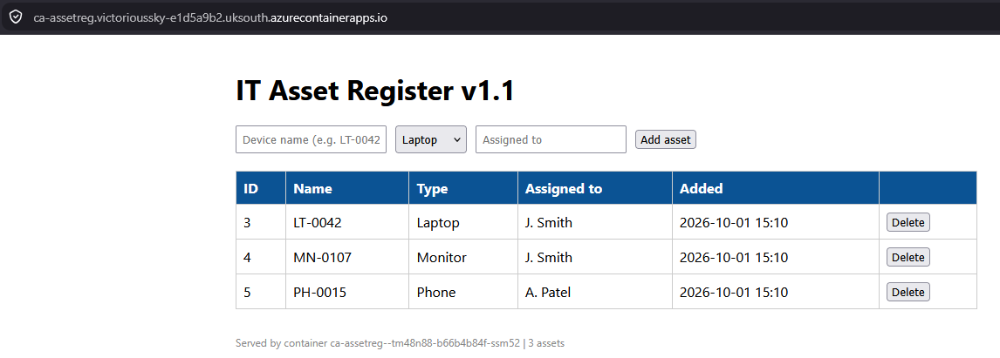

# Lab 05: Capstone, the Asset Register in Azure

## Overview

| | |
|---|---|
| **Goal** | Deploy my containerised [IT Asset Register](https://github.com/iM-MQ/docker-asset-register) to Azure, built entirely with Terraform and using remote state |
| **Deploys** | Azure Container Apps running my Docker image, Azure Database for PostgreSQL, Log Analytics, and supporting resources (9 resources) |
| **Providers** | `azurerm` v4 and `random` v3 |
| **Cost** | The PostgreSQL server is the main cost while running. Everything was destroyed after testing, and the actual cost was checked in Azure Cost Management afterwards |
| **Time** | About 2 hours, including troubleshooting |

This lab brings together everything from my Docker project and Terraform Labs 01 to 04. I took the same Asset Register image that my GitHub Actions pipeline builds and publishes, and ran it in Azure, with the database moved onto a managed service. Everything was defined in Terraform, with state stored remotely as set up in Lab 04.

Three problems came up along the way, all caused by defaults Azure applies that my code did not describe. Each one was found by reading the error or the plan carefully, and they are written up in the [debugging section](#debugging-write-ups).



## Architecture

```
Browser
   │  HTTPS, certificate managed by Azure
   ▼
┌───────────────────────────────────────┐
│ Azure Container Apps: ca-assetreg     │
│   web container (my image from GHCR)  │──── logs ──► Log Analytics workspace
│   database password held as a secret  │
└──────────────────┬────────────────────┘
                   │  encrypted connection (TLS)
┌──────────────────▼────────────────────┐
│ Azure Database for PostgreSQL 16      │
│   database: assets                    │
│   automatic backups, 7 days           │
└───────────────────────────────────────┘

Terraform state: Azure Storage (Lab 04 bootstrap)
```

## From Docker to Azure

The application code did not change at all. Only where each part runs changed:

| Docker on my laptop | Azure |
|---|---|
| `web` container built from my Dockerfile | The **same image**, pulled from GitHub Container Registry, pinned to a commit |
| `db` container running `postgres:16-alpine` | **Azure Database for PostgreSQL 16**, a managed service with automatic backups and patching |
| Password in a `.env` file | Password **generated by Terraform** and held as a **Container Apps secret** |
| `http://localhost:8080` | A public **HTTPS** address, with the certificate managed by Azure |
| Dockerfile `HEALTHCHECK` | Container Apps **liveness probe** on `/health` |
| Named volume for persistence | Data lives in the **managed database**, separate from the container |
| `depends_on: db` in Compose | `depends_on` in Terraform |

## Files

| File | Purpose |
|---|---|
| `providers.tf` | `azurerm` and `random` providers (copied from the Lab 04 bootstrap) |
| `backend.tf` | Stores state in the Azure Storage account from Lab 04 |
| `variables.tf` | Region, pinned container image, database name and admin username, tags |
| `main.tf` | Resource group and a random suffix for globally unique names |
| `database.tf` | Generated password, PostgreSQL server, database and firewall rule |
| `app.tf` | Log Analytics, Container Apps environment and the container app |
| `outputs.tf` | The app's URL, database server address and resource group |

I split the code by purpose rather than putting it all in `main.tf`. Terraform reads every `.tf` file in the folder together, so this is only for readability.

---

## Following along?

If you want to repeat this lab yourself, a few pointers:

- I ran every command in **PowerShell**, using the terminal inside **VS Code**.
- I created and edited files in **VS Code**. After every edit, **save with Ctrl + S and check the tab shows a cross, not a dot**. An unsaved edit caused one of my problems in this lab.
- Each command is in its own box. Run **one line at a time**.
- Boxes marked **What I saw** show my output. They are not commands to run.
- Anything in `<angle brackets>` needs replacing with your own value, **brackets included**.
- My storage account, server and app names include random endings. **Yours will be different.**
- You need a container image that is **public** on GitHub Container Registry, or Azure will not be able to pull it.

You will need the tools in the [main README prerequisites](../README.md#prerequisites), and the [Lab 04](../lab-04-remote-state) bootstrap for remote state.

---

## What was new in this lab

| Concept | What it does |
|---|---|
| **Azure Container Apps** | Runs containers without managing servers or Kubernetes |
| **Azure Database for PostgreSQL** | Managed PostgreSQL with automatic backups and patching |
| **`random_password`** | Terraform generates a strong password, so nobody chooses, types or stores one |
| **Secrets** | The password is passed to the app as a Container Apps secret, not plain text |
| **Pinned image tag** | The image is deployed by commit ID rather than `latest`, so exactly what is running is always known |
| **Explicit `depends_on`** | Forces an order Terraform cannot see from references alone |
| **Saved plans** | `terraform plan -out=tfplan` then `terraform apply tfplan` applies exactly what was reviewed |
| **`lifecycle ignore_changes`** | Stops Terraform treating a value Azure manages as a change |
| **Resource provider registration** | Subscriptions must be registered for each Azure service namespace before first use |

---

## How I built it

### Step 1: Checked Azure could pull my image

Azure has to be able to download the image, so it must be public. I checked on GitHub under **Packages > docker-asset-register**, which showed **Public**. I also confirmed the latest GitHub Actions run had passed.

The package page showed the image tagged with a commit ID:

```
ghcr.io/im-mq/docker-asset-register:208975d0a077290193b93a11e3fedc5ac4d8088a
```

I deployed that exact tag rather than `latest`, so the running version can never change unexpectedly. GitHub Container Registry names are always lowercase (`im-mq`).

### Step 2: Rebuilt the state storage

I had destroyed the state storage at the end of Lab 04, so I rebuilt it from the same code:

```powershell
cd C:\terraform-labs\lab-04-remote-state\bootstrap
```

```powershell
$env:ARM_SUBSCRIPTION_ID = az account show --query id -o tsv
```

```powershell
terraform apply
```

**What I saw:**

```
Apply complete! Resources: 4 added, 0 changed, 0 destroyed.

Outputs:

container_name = "tfstate"
resource_group_name = "rg-tfstate-uks"
storage_account_name = "sttfstatei3llx4"
```

The storage account had a new random ending, as the old random string had been destroyed with everything else.

### Step 3: Created the lab folder, provider file and backend

```powershell
cd C:\terraform-labs
```

```powershell
mkdir lab-05-capstone
```

```powershell
cd lab-05-capstone
```

```powershell
Copy-Item ..\lab-04-remote-state\bootstrap\providers.tf .
```

I created `backend.tf`:

```hcl
terraform {
  backend "azurerm" {
    resource_group_name  = "rg-tfstate-uks"
    storage_account_name = "sttfstatei3llx4"
    container_name       = "tfstate"
    key                  = "lab05-capstone.tfstate"
  }
}
```

> Following along? Replace `sttfstatei3llx4` with your own storage account name.

This project used remote state from the start, so there was nothing to migrate.

### Step 4: Wrote the variables

`variables.tf`:

```hcl
variable "location" {
  description = "Azure region to deploy into"
  type        = string
  default     = "uksouth"
}

variable "container_image" {
  description = "Asset Register image, pinned to a specific commit"
  type        = string
  default     = "ghcr.io/im-mq/docker-asset-register:208975d0a077290193b93a11e3fedc5ac4d8088a"
}

variable "db_name" {
  description = "Name of the application database"
  type        = string
  default     = "assets"
}

variable "db_admin_username" {
  description = "Administrator username for the PostgreSQL server"
  type        = string
  default     = "assetadmin"
}

variable "tags" {
  description = "Tags applied to every resource"
  type        = map(string)
  default = {
    environment = "lab"
    project     = "terraform-azure-labs"
    managed_by  = "terraform"
    owner       = "iM-MQ"
  }
}
```

There is deliberately no password variable. Azure also reserves usernames such as `admin` and `root` for PostgreSQL, so I used `assetadmin`.

### Step 5: Wrote the shared resources

`main.tf`:

```hcl
# Random ending for names that must be unique across Azure
resource "random_string" "suffix" {
  length  = 6
  upper   = false
  special = false
}

# Resource group for the whole application
resource "azurerm_resource_group" "app" {
  name     = "rg-tflab05-uks"
  location = var.location
  tags     = var.tags
}
```

### Step 6: Wrote the database

`database.tf`, shown here in its final form including the fix from [Problem 2](#problem-2-postgresql-availability-zone):

```hcl
# Strong password generated by Terraform; nobody has to choose or type it
resource "random_password" "db" {
  length           = 24
  special          = true
  override_special = "-_"
  min_upper        = 2
  min_lower        = 2
  min_numeric      = 2
  min_special      = 2
}

# Managed PostgreSQL server
resource "azurerm_postgresql_flexible_server" "db" {
  name                          = "psql-assetreg-${random_string.suffix.result}"
  resource_group_name           = azurerm_resource_group.app.name
  location                      = azurerm_resource_group.app.location
  version                       = "16"
  sku_name                      = "B_Standard_B1ms"
  storage_mb                    = 32768
  backup_retention_days         = 7
  administrator_login           = var.db_admin_username
  administrator_password        = random_password.db.result
  public_network_access_enabled = true
  tags                          = var.tags

  # Azure chooses the availability zone; don't treat that as a change
  lifecycle {
    ignore_changes = [zone]
  }
}

# The application's database on that server
resource "azurerm_postgresql_flexible_server_database" "assets" {
  name      = var.db_name
  server_id = azurerm_postgresql_flexible_server.db.id
  charset   = "UTF8"
  collation = "en_US.utf8"
}

# Allow connections from Azure services, such as Container Apps
resource "azurerm_postgresql_flexible_server_firewall_rule" "azure_services" {
  name             = "AllowAzureServices"
  server_id        = azurerm_postgresql_flexible_server.db.id
  start_ip_address = "0.0.0.0"
  end_ip_address   = "0.0.0.0"
}
```

| Part | Why |
|---|---|
| `random_password` | 24 characters with a mix of character types, as Azure requires. Special characters are limited to `-` and `_` so they cannot break the app's connection string |
| `version = "16"` | Matches the `postgres:16-alpine` image used in Docker |
| `B_Standard_B1ms` | The smallest Burstable size, 1 vCPU and 2 GB RAM |
| `backup_retention_days = 7` | Automatic backups, something the Docker volume never had |
| Firewall rule `0.0.0.0` to `0.0.0.0` | A special Azure range meaning "allow Azure services", so Container Apps can connect |

**Security note:** the `AllowAzureServices` rule allows connections from any Azure service, including other customers' subscriptions, although they would still need the password. It was acceptable for a short-lived lab. In production I would put the database on a private network using VNet integration or a private endpoint, the cloud equivalent of the `internal: true` network in my Docker project.

The generated password is stored in the Terraform state, which is why the state lives in a private, encrypted storage account rather than on my laptop.

### Step 7: Wrote the app

`app.tf`, shown in its final form including the fixes from [Problem 3](#problem-3-container-apps-workload-profile):

```hcl
# Log Analytics workspace: collects the container's logs
resource "azurerm_log_analytics_workspace" "app" {
  name                = "log-assetreg-${random_string.suffix.result}"
  location            = azurerm_resource_group.app.location
  resource_group_name = azurerm_resource_group.app.name
  sku                 = "PerGB2018"
  retention_in_days   = 30
  tags                = var.tags
}

# Container Apps environment: the shared space the app runs in
resource "azurerm_container_app_environment" "app" {
  name                       = "cae-assetreg"
  location                   = azurerm_resource_group.app.location
  resource_group_name        = azurerm_resource_group.app.name
  log_analytics_workspace_id = azurerm_log_analytics_workspace.app.id
  tags                       = var.tags

  # Azure's default pay-per-use profile, declared so the code matches reality
  workload_profile {
    name                  = "Consumption"
    workload_profile_type = "Consumption"
  }
}

# The Asset Register itself, running my image
resource "azurerm_container_app" "web" {
  name                         = "ca-assetreg"
  container_app_environment_id = azurerm_container_app_environment.app.id
  resource_group_name          = azurerm_resource_group.app.name
  revision_mode                = "Single"
  workload_profile_name        = "Consumption"
  tags                         = var.tags

  # The database password, stored as a secret rather than plain text
  secret {
    name  = "db-password"
    value = random_password.db.result
  }

  template {
    min_replicas = 1
    max_replicas = 1

    container {
      name   = "web"
      image  = var.container_image
      cpu    = 0.25
      memory = "0.5Gi"

      env {
        name  = "DB_HOST"
        value = azurerm_postgresql_flexible_server.db.fqdn
      }

      env {
        name  = "DB_NAME"
        value = var.db_name
      }

      env {
        name  = "DB_USER"
        value = var.db_admin_username
      }

      env {
        name        = "DB_PASSWORD"
        secret_name = "db-password"
      }

      liveness_probe {
        transport = "HTTP"
        port      = 5000
        path      = "/health"
      }
    }
  }

  ingress {
    external_enabled = true
    target_port      = 5000
    transport        = "auto"

    traffic_weight {
      latest_revision = true
      percentage      = 100
    }
  }

  # Don't start the app until its database and firewall rule exist
  depends_on = [
    azurerm_postgresql_flexible_server_database.assets,
    azurerm_postgresql_flexible_server_firewall_rule.azure_services,
  ]
}
```

The environment variable names are the same as in my `compose.yaml`, which is why the app code needed no changes.

**Why `depends_on`?** The app references the database server's address, so Terraform knows to build the server first. It does not reference the database or the firewall rule, so without `depends_on` the app could start before either existed and fail to connect. Explicit `depends_on` is only needed when a real dependency is not visible in the code.

`min_replicas = 1` keeps one copy running so the app responds immediately. Setting it to `0` would let Container Apps scale to zero when idle, which saves money at the cost of a slower first request.

### Step 8: Wrote the outputs

`outputs.tf`:

```hcl
output "app_url" {
  description = "Public web address of the Asset Register"
  value       = "https://${azurerm_container_app.web.ingress[0].fqdn}"
}

output "database_server" {
  description = "PostgreSQL server address"
  value       = azurerm_postgresql_flexible_server.db.fqdn
}

output "resource_group_name" {
  description = "Resource group holding the application"
  value       = azurerm_resource_group.app.name
}
```

There is deliberately no output for the password.

### Step 9: Initialised and validated

```powershell
$env:ARM_SUBSCRIPTION_ID = az account show --query id -o tsv
```

```powershell
terraform init
```

```powershell
terraform fmt
```

```powershell
terraform validate
```

**What I saw:**

```
Success! The configuration is valid.
```

### Step 10: Kept saved plans out of Git

A saved plan file contains every value, including the generated password in readable form, so I added plan files to the repository's `.gitignore`:

```powershell
Add-Content ..\.gitignore "`n# Saved plan files: can contain secrets, never commit`ntfplan`n*.tfplan"
```

### Step 11: Planned and applied

This time I saved the plan and applied exactly that file, as would happen in a team pipeline:

```powershell
terraform plan -out=tfplan
```

```
Plan: 9 to add, 0 to change, 0 to destroy.

Changes to Outputs:
  + app_url             = (known after apply)
  + database_server     = (known after apply)
  + resource_group_name = "rg-tflab05-uks"

Saved the plan to: tfplan
```

The password showed as `(sensitive value)` in the plan. Terraform hides values it knows are secret.

```powershell
terraform apply tfplan
```

Applying a saved plan does not ask for `yes`, because the plan has already been reviewed. The first apply failed partway through ([Problem 1](#problem-1-resource-provider-not-registered)), and after fixing that, two more issues came up ([Problems 2](#problem-2-postgresql-availability-zone) and [3](#problem-3-container-apps-workload-profile)). Once all three were resolved:

**What I saw:**

```
Apply complete! Resources: 1 added, 0 changed, 0 destroyed.

Outputs:

app_url = "https://ca-assetreg.victorioussky-e1d5a9b2.uksouth.azurecontainerapps.io"
database_server = "psql-assetreg-uicgm0.postgres.database.azure.com"
resource_group_name = "rg-tflab05-uks"
```

### Step 12: Confirmed the code matched Azure

```powershell
terraform plan
```

```
No changes. Your infrastructure matches the configuration.
```

---

## Tests I carried out

### Test 1: The app works end to end

I opened the `app_url` in my browser. The page loaded over HTTPS with an Azure-managed certificate, showed the **v1.1** heading (confirming it was the exact image version I pinned), and the footer showed it was served by an Azure container rather than my laptop. I added three test assets, and they were saved to the managed database.

I then checked the app's logs from PowerShell:

```powershell
az containerapp logs show --name ca-assetreg --resource-group rg-tflab05-uks --tail 30
```

**What I saw** (shortened):

```
"GET / HTTP/1.1" 200
"POST /add HTTP/1.1" 302
"GET / HTTP/1.1" 200
127.0.0.1 "GET /health HTTP/1.1" 200
127.0.0.1 "GET /health HTTP/1.1" 200
"GET /favicon.ico HTTP/1.1" 404
```

| Log line | Meaning |
|---|---|
| `GET / 200` | The page loaded |
| `POST /add 302` | An asset was saved, then the browser was redirected back to the list |
| `GET /health 200` every 10 seconds from `127.0.0.1` | The liveness probe checking the app is healthy |
| `GET /favicon.ico 404` | The browser asking for a tab icon the app does not have. Harmless |

### Test 2: Data survives a container restart

**Goal:** prove the data lives in the database, not the container.

I found the active revision:

```powershell
az containerapp revision list --name ca-assetreg --resource-group rg-tflab05-uks --query "[].{Revision:name, Active:properties.active, Replicas:properties.replicas}" --output table
```

```
Revision              Active    Replicas
--------------------  --------  ----------
ca-assetreg--tm48n88  True      1
```

Then restarted it:

```powershell
az containerapp revision restart --name ca-assetreg --resource-group rg-tflab05-uks --revision ca-assetreg--tm48n88
```

```
"Restart succeeded"
```

After refreshing the page:

| | Before restart | After restart |
|---|---|---|
| Container | `ca-assetreg--tm48n88-b66b4b84f-ssm52` | `ca-assetreg--tm48n88-598c88866f-n6f8n` |
| Assets | 3 | The same 3 |

A brand-new container replaced the old one and found all the existing data. This is the cloud equivalent of the volume test in my Docker project.

---

## Debugging write-ups

### Problem 1: Resource provider not registered

**Symptom.** The first apply failed while creating the Container Apps environment:

```
Error: creating Managed Environment ... unexpected status 409 (409 Conflict) with error:
MissingSubscriptionRegistration: The subscription is not registered to use namespace 'Microsoft.App'.
```

**Investigation.** The error named the namespace directly: `Microsoft.App`, the resource provider behind Container Apps. Everything else had been created successfully, because those providers (networking, storage, PostgreSQL) were already registered from earlier work.

**Root cause.** Azure services are grouped into resource providers, and a subscription has to be registered for each one before it can use it. My subscription had never used Container Apps.

**Fix.**

```powershell
az provider register --namespace Microsoft.App
```

```powershell
az provider show --namespace Microsoft.App --query registrationState -o tsv
```

I repeated the second command until it changed from `Registering` to `Registered`, which took a couple of minutes. The resources already created were safely recorded in the remote state, so nothing had to be rebuilt. The saved plan was now out of date, so I created a fresh one before applying again.

**Prevention.** On a new subscription, check required providers are registered before deploying a service for the first time.

### Problem 2: PostgreSQL availability zone

**Symptom.** The fresh plan failed with:

```
Error: `zone` can only be changed when exchanged with the zone specified in
`high_availability.0.standby_availability_zone`
```

**Investigation.** My code did not specify an availability zone, so I checked what Azure had done:

```powershell
az postgres flexible-server list --resource-group rg-tflab05-uks --query "[].{Name:name, Zone:availabilityZone, State:state}" --output table
```

Azure had placed the server in a zone of its own choosing and Terraform had recorded it in state.

**Root cause.** On the next plan, Terraform compared my code (no zone) with the state (Azure's zone) and treated the difference as an attempt to change the zone, which this resource does not allow.

**Fix.** I told Terraform to ignore the zone, as Azure manages it:

```hcl
  lifecycle {
    ignore_changes = [zone]
  }
```

**What I learned.** `ignore_changes` should be used sparingly, because anything ignored is no longer covered by drift detection. It suits values the platform chooses itself, like this one.

**A mistake along the way.** My first attempt put the `lifecycle` block after the resource's closing brace, so it was outside the resource. The VS Code Problems panel flagged `Blocks of type "lifecycle" are not expected here`. Deleting the extra `}` above it moved the block inside the resource.

### Problem 3: Container Apps workload profile

**Symptom.** With the zone fixed, the plan showed `1 to add, 1 to change`. I had not expected a change, so I looked at what it was before applying:

```powershell
terraform show tfplan | Select-String "# "
```

```powershell
terraform show -no-color tfplan | Select-String -Pattern "container_app_environment.app will be" -Context 0,25
```

**What I saw:**

```
  ~ resource "azurerm_container_app_environment" "app" {
      - workload_profile {
          - name                  = "Consumption" -> null
          - workload_profile_type = "Consumption" -> null
        }
    }
```

**Root cause.** When Azure created the environment, it added a default **Consumption** workload profile, the pay-per-use plan Container Apps runs on. My code did not mention it, so Terraform planned to remove it. Applying that would have tried to remove what the environment runs on.

**Fix.** Rather than ignoring it, I made the code describe what was really there, so the setting stays visible and protected by drift detection:

```hcl
  workload_profile {
    name                  = "Consumption"
    workload_profile_type = "Consumption"
  }
```

The app was then created successfully. However, the next plan showed the same pattern one level down: Azure had placed the app on that profile, and Terraform wanted to remove `workload_profile_name = "Consumption"` from the app. I added that line to the container app as well.

**A mistake along the way.** My first edit to add `workload_profile_name` had not been saved, so the plan kept showing the change. I confirmed it from PowerShell:

```powershell
Select-String -Path app.tf -Pattern "workload_profile_name"
```

This returned nothing, so the line was not on disk. I added it from PowerShell instead, which saves straight to the file:

```powershell
(Get-Content app.tf -Raw) -replace '(revision_mode\s*=\s*"Single")', "`$1`n  workload_profile_name = `"Consumption`"" | Set-Content app.tf -NoNewline
```

```powershell
terraform fmt
```

After that, `terraform plan` showed `No changes`. This was the same lesson as Lab 03: Terraform reads the file on disk, not what the editor shows.

**What I learned.** When a plan shows something unexpected, check exactly what it is before applying. Here, applying without looking would have tried to remove the environment's compute profile. Where Azure adds a sensible default, declaring it in code is usually better than ignoring it.

---

## Clean up

The app's state lives in the storage account, so I destroyed the app first:

```powershell
terraform destroy
```

I typed `yes` when asked. The PostgreSQL server took a few minutes to delete.

```
Destroy complete! Resources: 9 destroyed.
```

Then the state storage:

```powershell
cd ..\lab-04-remote-state\bootstrap
```

```powershell
terraform destroy
```

```
Destroy complete! Resources: 4 destroyed.
```

I confirmed with `az group list --output table` that neither resource group remained.

---

## Command reference

| Command | What it does |
|---|---|
| `terraform plan -out=tfplan` | Saves the plan to a file |
| `terraform apply tfplan` | Applies exactly the saved plan, without asking for `yes` |
| `terraform show tfplan` | Displays a saved plan |
| `terraform show -no-color tfplan \| Select-String ...` | Searches a saved plan without colour codes |
| `az provider register --namespace <namespace>` | Registers a resource provider on the subscription |
| `az provider show --namespace <namespace> --query registrationState -o tsv` | Shows registration status |
| `az postgres flexible-server list ...` | Lists PostgreSQL servers and their zones |
| `az containerapp logs show --name <app> --resource-group <rg> --tail 30` | Shows the app's recent logs |
| `az containerapp revision list ...` | Lists the app's revisions |
| `az containerapp revision restart ...` | Restarts a revision |
| `Select-String -Path <file> -Pattern <text>` | Checks whether text is in a file on disk |

## What I learned

- The same container image ran unchanged on my laptop and in Azure. Only the platform around it changed, which is the main point of containers.
- Managed services take work off my hands. The database came with automatic backups and patching, and HTTPS came with a managed certificate.
- Secrets do not need to be chosen or stored by people. Terraform generated the password and passed it to the app as a secret, and it never appeared in the code, the plan output or the outputs.
- Pinning the image to a commit ID means I always know exactly which version of the code is running.
- Azure applies defaults that the code may not describe: provider registration, availability zones and workload profiles. Each showed up as an error or an unexpected plan change, and reading the message or the plan properly was enough to find the cause.
- When a plan shows a change I did not expect, I check what it is before applying, rather than assuming it is harmless.
- Saved plans make sure what gets applied is exactly what was reviewed, but they contain secrets in readable form, so they must never be committed.